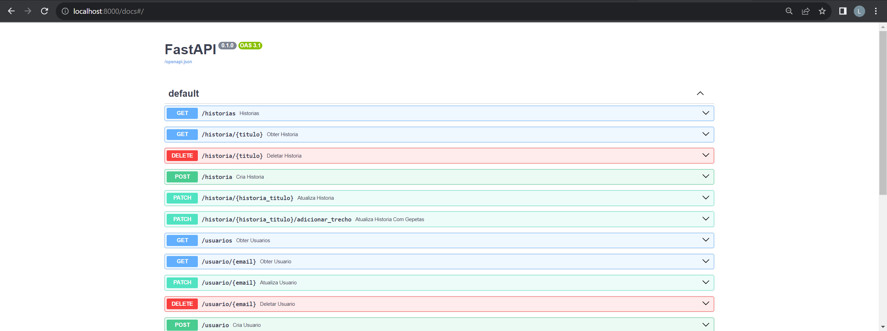

# Ponderada Semana 7

Desenvolvimento de uma API com as seguintes funcionalidades:
- CRUD de Histórias;
- CRUD de Usuários;
- Integração com a API do ChatGPT para criação de trechos;
- Testes unitários e de integração

## Tecnologias e frameworks utilizados e como instala-los

### RDS - AWS
Não necessita instalação
Obs: Utilizado um banco de dados MySQL

### python-dotenv
Este guia fornece instruções para instalar e usar a biblioteca `python-dotenv` em seu projeto Python. O `python-dotenv` permite carregar variáveis de ambiente de um arquivo `.env`.

## Instalação do python-dotenv

Siga estas etapas para instalar o `python-dotenv`:

1. Abra o terminal ou linha de comando.

2. Use o gerenciador de pacotes Python, `pip`, para instalar o `python-dotenv` executando o seguinte comando: `pip install python-dotenv`

### SQLAlchemy 
Este guia fornece instruções para instalar o SQLAlchemy em seu ambiente de desenvolvimento. SQLAlchemy é uma biblioteca Python poderosa para trabalhar com bancos de dados relacionais.

## Pré-requisitos

Antes de começar, verifique se você atende aos seguintes pré-requisitos:

- Python instalado em seu sistema.

Se o Python não estiver instalado, faça o download e instale a versão mais recente no [site oficial do Python](https://www.python.org/).

Siga estas etapas para instalar o SQLAlchemy:

1. Abra o terminal ou linha de comando.

2. Use o gerenciador de pacotes Python, `pip`, para instalar o SQLAlchemy executando o seguinte comando: `pip install sqlalchemy`

Isso instalará o SQLAlchemy e suas dependências.

3. Verifique se o SQLAlchemy foi instalado corretamente executando o seguinte comando no terminal: `python -c "import sqlalchemy; print(sqlalchemy.version)`"

### FastAPI
Este guia fornece instruções para instalar o FastAPI em seu ambiente de desenvolvimento. O FastAPI é um framework web moderno para criar APIs em Python de forma rápida e fácil.

## Instalação

Siga estas etapas para instalar o FastAPI:

1. Abra o terminal ou linha de comando.

2. Use o gerenciador de pacotes Python, `pip`, para instalar o FastAPI executando o seguinte comando: `pip install fastapi`

Isso instalará o FastAPI e suas dependências.

3. Opcionalmente, você pode instalar o servidor ASGI Uvicorn, frequentemente usado com o FastAPI para executar sua aplicação. Execute o seguinte comando para instalá-lo: `pip install uvicorn`

Para executar a aplicação FastAPI, use o comando Uvicorn (se você instalou o Uvicorn): `uvicorn main:app`

A aplicação FastAPI estará disponível em http://localhost:8000/. Você pode acessar a documentação interativa da API em http://localhost:8000/docs.

Figura 1: Documentação interativa API Histórias

**Obs: Para realizar os testes da API basta ir até o repositorio raiz e executar o comando `pytest`**